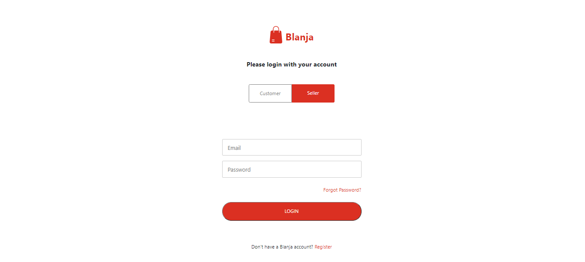
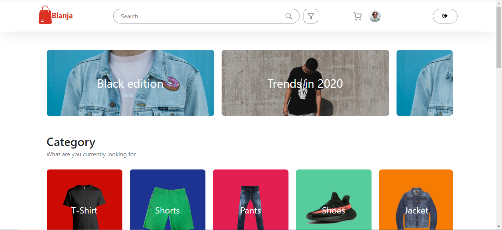
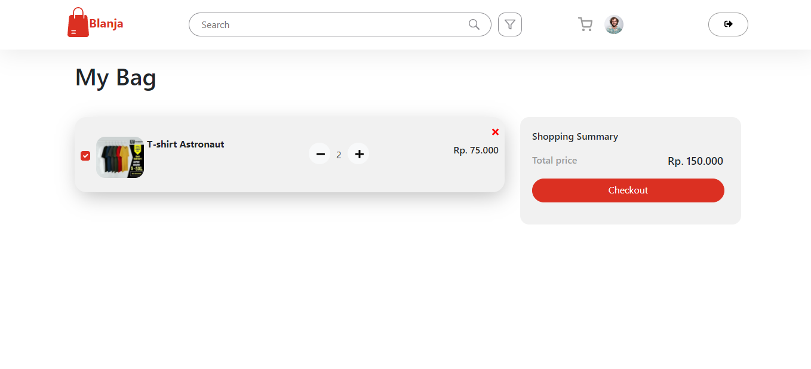

# Blanja Web 

## Contents

- [Description](#description)
- [Features](#features)
- [Requirements](#requirements-for-development)
- [Installation](#installation-for-development)
- [Screenshoots](#screenshoots)
- [Demo Blanja Web](#demo-blanja-web)
- [Related Project](#related-project)

## Description

**Blanja Web** is a web-based e-commerce application that allows buyers to order
products of their choice. Consists of 2 types of users, namely buyers and
sellers.

## Features

- Order product
- History transaction
- Add product (sellers only)
- Reset Password
- etc

## Requirements for Development

- [`Blanja Backend`](https://github.com/handa26/products-api)

## Installation for Development

Use the package manager [npm](https://www.npmjs.com/get-npm) to install all required dependecies.
```bash
npm install
```
After that, create a file **_.env_** in root directory with the following contents :

```bash
REACT_APP_BASEURL = "http://host_backend:port_backend"
```

Example :

- http://host_backend:port_backend is http://localhost:8000

so, you can write in .env file like this :

```bash
REACT_APP_BASEURL = "http://localhost:8000"
```

Now you're ready to development, just make sure your backend is running perfectly, type `npm start` in terminal for start developing.
If you're ready to build this project, type `npm run build`, it'll make new folder called `build` and there your entire project will run.

## Screenshoots

<div align="center">
    
    
    
</div>

## Demo Blanja Web

Coming soon!
<!-- This is Blanja Web build version, let's try it.

<a href="http://54.175.146.137:3000/">
  
</a> -->

## Related Project

RESTful API for this web application, clone this for development Blanja Web.

<a href="https://github.com/handa26/products-api">

</a>